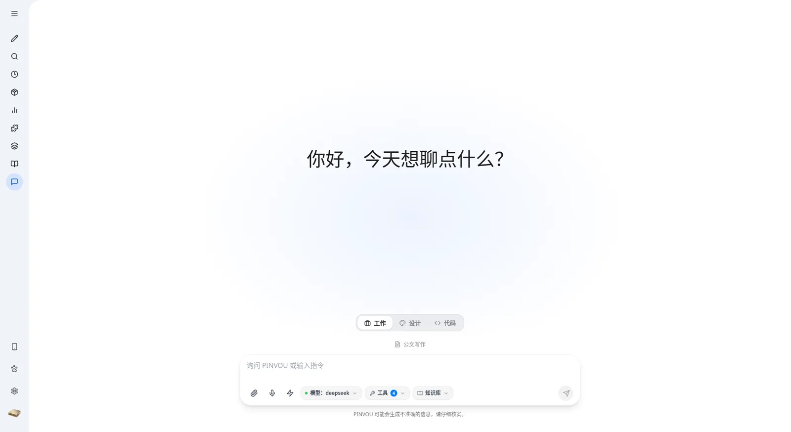
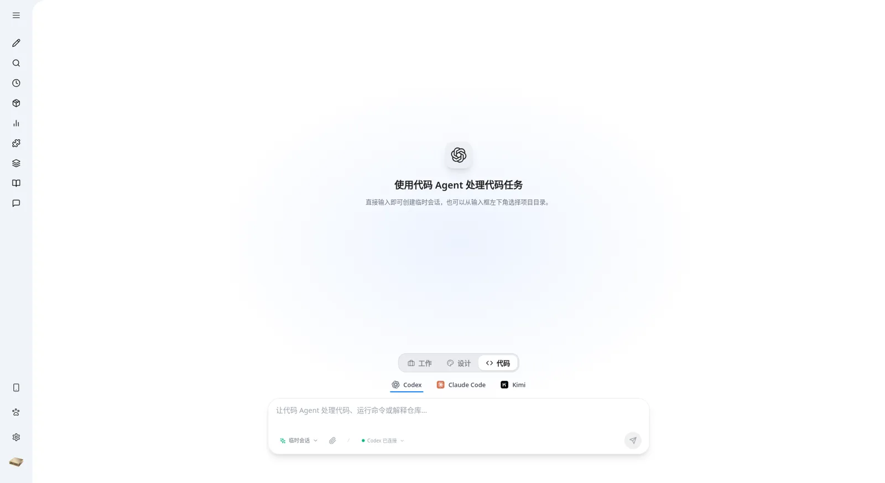
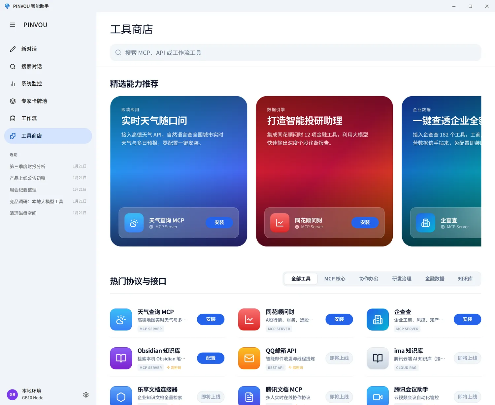
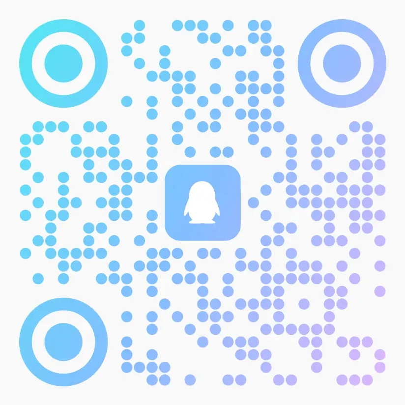

<div align="center">


# Pinvou Agent

**仕事、デザイン、コーディングのためのオープンソース・デスクトップ AI Agent ワークスペース。**

[English](README.md) · [简体中文](README.zh-CN.md) · [日本語](README.ja.md)

[](https://github.com/Pinvou/pinvou-agent/actions/workflows/pr-check.yml)
[](LICENSE)
[](pinvou3-app/package.json)
[](#-クイックスタート)
[](https://github.com/Pinvou/pinvou-agent/stargazers)

[プレビュー版をダウンロード](https://github.com/Pinvou/pinvou-agent/releases) · [ウェブサイト](https://pinvou.com/) · [QQ グループ](#-コミュニティとセキュリティ) · [Issues](https://github.com/Pinvou/pinvou-agent/issues) · [Discussions](https://github.com/Pinvou/pinvou-agent/discussions) · [セキュリティ](SECURITY.md)

<p align="center">
  <a href="https://pinvou.com/assets/videos/pinvou-agent-feature-update-2026-07.mp4">
    
  </a>
</p>
<p align="center">
  <a href="https://pinvou.com/assets/videos/pinvou-agent-feature-update-2026-07.mp4"><strong>▶ 90秒の機能デモを見る（中国語）</strong></a>
</p>

</div>

Pinvou Agent は、単なるチャットウィンドウではありません。日々の仕事、ビジュアルデザイン、ソフトウェア開発を 1 つのデスクトップワークスペースにまとめ、チャットの返事で終わらせるのではなく、**成果**で終わるべきタスクのために設計されています。ツールを使い、ファイルを操作し、個人の知識を蓄えられます。ACP 経由で専用のコーディング Agent を実際のプロジェクトに取り込んだり、プロンプトから後で編集を続けられるビジュアル成果物を生み出したりすることもできます。

ローカルモデルを使えば完全にプライベートなループで動作し、OpenAI 互換のエンドポイントであれば自由に接続できます。MCP サーバー、CLI コネクター、スキル、ワークフローで Agent を拡張しましょう。

## 🧭 ひとつのワークスペース、3つの働き方

### 💼 作業：Agent に実際のタスクを任せる

添付ファイル、個人ナレッジ、専門ペルソナ、スキル、MCP ツール、ワークフローを組み合わせて、調査、分析、執筆を行い、再利用できるファイルとして成果を納品します。返ってくるのは、ただのチャット文章ではありません。

### 🎨 デザイン：プロンプトから編集可能なビジュアルへ

自然言語でポスターやデータビジュアライゼーションを作成します。結果をデザインモードで開き、要素を直接選択して、コピー、フォント、色、サイズ、レイアウトを調整できます。変更を言葉で伝え続ければ、Agent が現在のデザインに沿って反復改善します。

### 💻 コード：実際のプロジェクトにコーディング Agent を取り込む

同じデスクトップワークスペース上で、[ACP](docs/multi-agent-acp.md) 経由で **Codex、Claude Code、Kimi** を利用できます。コーディング Agent は、実際のプロジェクトや隔離された一時ワークスペースの読み書き、コマンドの実行を行い、実行計画、ツールの実行手順、権限リクエスト、ファイル変更を可視化します。セッションはワークスペースに紐付いたまま保持され、アプリを再起動した後も続きから再開できます。

## ✨ 主な機能

### 🎯 会話から成果物へ

- タイトル検索付きの**マルチセッションワークスペース** — メッセージ、ツール呼び出し、成果物は各セッションごとに保存されます
- PDF、Office 文書、画像、テキストの**添付ファイル**に対応 — ドラッグ＆ドロップや貼り付けで追加できます
- **成果物パネル**が Agent が作成・編集したすべてのファイルを自動で収集。1 箇所でプレビュー、検索、オープンできます
- **編集可能な Markdown 成果物** — 直接編集できるほか、一節を選択して Agent に書き直してもらうこともできます
- **Plan / YOLO モード** — 複雑な作業はまず計画を確認してから実行し、明確なタスクは直接実行できます

### 🧠 知識とメモリ

- ファイル管理、全文検索、ベクトル検索を備えた**ローカルナレッジベース**。1 つのチャットに複数のコレクションを取り付け、それぞれを個別に有効化 / 無効化でき、回答にはコレクションとファイルの出所が保持されます
- **メモリセンター**が長期的な好みや文脈を蓄積。保存する候補を明示的にレビュー・承認できます
- **ペルソナカードプール** — 分野ごとの専門ロールを作成、保存し、切り替えて適用できます
- **スキル、コマンド、ワークフロー**が、実績のあるやり方を安定して再利用できる能力に変えます

### 🔌 実用的なツールとコネクター

- ローカル MCP サーバー、リモート MCP サーバー、CLI ツール、API コネクターをまとめて管理する**統合ツールストア**
- 対応サービスでは **OAuth / SSO 認証**を利用可能 — キーを手動で貼り付ける必要はありません
- **Feishu (Lark)、DingTalk、WeCom、Tencent Meeting、Tencent ima、Obsidian**、企業ナレッジベース、法務 / 企業データサービス向けのすぐに使えるコネクター
- **リモートコントロール** — スマートフォンで QR コードを読み取るだけで、実行中のワークスペースを確認・操作できます

### 🖥️ 日常の運用を支える機能

- **ローカル音声入力**に対応。音声認識モデルは必要に応じてダウンロードします
- GPU、メモリ、ディスク、モデルサービス、コンテキスト使用量の**一元モニタリング**
- アップデートは **GitHub Releases** 経由 — アプリ内アップデートの確認はまだ有効ではありません
- セッション、設定、知識、ランタイム拡張はすべて `~/.pinvou3/` の下に保存されます

> [!NOTE]
> データがマシンの外に出るかどうかは、有効にしたモデルとツールによって変わります。ローカルモデルとローカルツールの組み合わせなら、処理は完全にローカルに留まります。クラウドモデル、リモート MCP サーバー、サードパーティコネクターは、関連するリクエストをそれぞれのサービスに送信します。

## 📸 スクリーンショット

<table>
  <tr>
    <td width="50%"></td>
    <td width="50%"></td>
  </tr>
  <tr>
    <td align="center">ポスターやデータビジュアライゼーションのためのデザインモード</td>
    <td align="center">Codex、Claude Code、Kimi を使えるコードモード</td>
  </tr>
  <tr>
    <td width="50%"></td>
    <td width="50%"></td>
  </tr>
  <tr>
    <td align="center">ツールとコネクターで Agent を拡張</td>
    <td align="center">生成した成果物をプレビューして納品</td>
  </tr>
</table>

## 🤖 モデル接続

Pinvou Agent は**ローカル vLLM** と任意の **OpenAI 互換 API** で動作します。複数のモデル設定をアプリに保存でき、クラウド設定には任意の表示名（エイリアス）を付けられます。プロバイダーに送るモデル識別子を変えずに、セッションごとに切り替えられます。内蔵テンプレートは、ローカル vLLM、DeepSeek、Kimi、Qwen、Doubao、MiniMax、Zhipu (GLM)、MiMo、OpenAI、Anthropic、Gemini、xAI に対応 — その他のカスタム互換エンドポイントも入力できます。

ローカル vLLM の例:

```bash
export DEEPSEEK_BASE_URL="http://127.0.0.1:8000/v1"
export DEEPSEEK_API_KEY="local-no-auth"
export DEEPSEEK_MODEL="your-model-name"
```

エンドポイント、モデル名、API キーは、アプリケーション設定から直接管理することもできます。信頼できる開発ネットワーク内のループバック以外のプレーン HTTP エンドポイントを使う場合は、`DEEPSEEK_ALLOW_INSECURE_HTTP=1` を明示的に設定してください。

## 🚀 クイックスタート

### 前提条件

- サブモジュールに対応した Git
- Node.js と npm
- 最新の Rust ツールチェーン
- お使いのプラットフォーム向けの [Tauri 2 のシステム依存関係](https://v2.tauri.app/start/prerequisites/)
- アクセス可能な OpenAI 互換モデルエンドポイント

ソースツリーは **Linux、Windows、macOS** に対応しています。Linux のリリースパッケージは、x86_64 と arm64 の Ubuntu 22.04 以降（glibc 2.35+）を対象としており、deb はさらに WebKitGTK 2.40+ が必要です（標準の updates pocket を適用済みの 22.04 システムであれば条件を満たします）。macOS のリリースパッケージは、macOS 11 以降向けのユニバーサル（Apple Silicon と Intel）ビルドです。音声認識エンジンはビルド構成ごとにパッケージ化できます。ファイル解析（PDF / Office / OCR / アーカイブ）は、プラットフォームのパッケージマネージャーでインストールできるオプションの外部ツールに依存します（`pinvou3-app/INSTALL.md` を参照）。

### ソースから実行

```bash
git clone --recursive https://github.com/Pinvou/pinvou-agent.git
cd pinvou-agent/pinvou3-app
npm ci
cd ..
./pinvou3-app/run-dev.sh
```

サブモジュールなしでクローンした場合は:

```bash
git submodule update --init --recursive
```

## 🏗️ アーキテクチャ

[](https://v2.tauri.app/)
[](https://react.dev/)
[](https://vite.dev/)
[](https://www.rust-lang.org/)

```text
React + Vite UI
       ↕ Tauri commands / events
pinvou3-app (desktop orchestration)
       ↕ EngineHandle / AgentHarness
CodeWhale (agent engine submodule)
       ├─ OpenAI-compatible model services
       ├─ MCP servers and CLI connectors
       └─ Skills, Commands, Hooks, and Compaction
```

[CodeWhale](https://github.com/Pinvou/CodeWhale) が Agent エンジンを提供します: モデル呼び出し、ストリーミング、ツール実行、セッション、MCP、スキル、フック、コンパクション。`pinvou3-app/` はデスクトップ UI、ランタイム設定、オーケストレーション、OS 統合を担い、エンジンの機能を再実装することはありません。

| 拡張の目的 | 実装する場所 |
|---|---|
| ドメイン Agent やツールバンドルを追加する | `SKILL.md` パッケージ |
| 外部 API につなぐ | 独立した MCP サーバーまたはコネクター |
| モデルの振る舞いを導く | バンドルの指示ファイル（`instructions.md`） |
| デスクトップ UI やシステム統合を変える | `pinvou3-app/` |
| 再利用可能なエンジンの問題を修正する | [フォークポリシー](docs/fork-policy.md) に従う CodeWhale フォーク |

## 📁 リポジトリ構成

```text
pinvou3-app/          Tauri 2 + React/Vite デスクトップアプリケーション
CodeWhale/            Agent エンジン（サブモジュール）
pinvou-knowledge/     再利用可能なナレッジコアとスタンドアロンサーバー
remote-control-relay/ QR コードによるリモートコントロール用の任意設置（セルフホスト）中継
pinvou3-app/resources/mcp-servers/
                      独立したローカル MCP サーバー
scripts/              テスト、ガード、ビルド、リリース用の補助スクリプト
docs/                 アーキテクチャと保守のドキュメント
```

## 🧪 開発チェック

以下のコマンドをリポジトリのルートから実行します:

```bash
(cd pinvou3-app && npm run lint:ui)
(cd pinvou3-app && npm run build:ui)
(cd pinvou3-app && npm test)

(cd pinvou3-app/src-tauri && cargo test --lib -- --test-threads=1)

./scripts/fork-guard.sh --fast
```

## 🤝 コントリビュート

コントリビューションを歓迎します! コントリビューションのワークフローと CI ゲートについては [CONTRIBUTING.md](CONTRIBUTING.md) を、CodeWhale のメンテナンスルールについては [fork ポリシー](docs/fork-policy.md) と [現在のフォーク変更一覧](docs/fork-modifications.md) を参照してください。参加することで、[行動規範](CODE_OF_CONDUCT.md) に同意したものとみなされます。

## 💬 コミュニティとセキュリティ

- 🐧 **QQ ユーザーグループ（中国語 / Chinese）: 1108909346** — 下の QR コードを読み取るか、QQ でグループ番号を検索してください
- 🐛 [GitHub Issues](https://github.com/Pinvou/pinvou-agent/issues) — 再現手順のあるバグや、焦点の定まった機能リクエスト
- 💡 [GitHub Discussions](https://github.com/Pinvou/pinvou-agent/discussions) — 質問やアイデア（コミュニティサポートはベストエフォートです。[SUPPORT.md](SUPPORT.md) を参照）
- 🔒 **セキュリティの脆弱性を公開イシューで報告しないでください** — [SECURITY.md](SECURITY.md) の非公開チャネルか、`security@pinvou.com` 宛のメールを利用してください

<p align="center">
  
</p>

ライセンス、サードパーティの帰属表示、SBOM、ブランド利用の範囲、拡張マーケットの概要は、[THIRD_PARTY_NOTICES.md](THIRD_PARTY_NOTICES.md)、[docs/sbom.md](docs/sbom.md)、[TRADEMARKS.md](TRADEMARKS.md)、[docs/工具市场.md](docs/工具市场.md) にまとめられています。

## 🔗 フレンドリーリンク

- [LINUX DO](https://linux.do/)

## ⭐ Star History

<a href="https://www.star-history.com/?repos=pinvou%2Fpinvou-agent&type=date">
 <picture>
   <source media="(prefers-color-scheme: dark)" srcset="https://api.star-history.com/chart?repos=pinvou%2Fpinvou-agent&type=date&theme=dark&sealed_token=k7dkorBV3gOYRbA3ai0hCjYhzSjr1TFHk6Z9Lxdr5i_rhBGio7qlD80ERUfWzofzxF8394-zl1QwsZJEhzGPELvh9_Fm4xXR5Jm4xdEAfAENh8uizuoqey8O1_1aY5b-IZZsqiZjk3VyNn3v8sAgDQmveN9oz2jtOlYmwOYMYZYOhJp8mTouzJQyRCAB" />
   <source media="(prefers-color-scheme: light)" srcset="https://api.star-history.com/chart?repos=pinvou%2Fpinvou-agent&type=date&sealed_token=k7dkorBV3gOYRbA3ai0hCjYhzSjr1TFHk6Z9Lxdr5i_rhBGio7qlD80ERUfWzofzxF8394-zl1QwsZJEhzGPELvh9_Fm4xXR5Jm4xdEAfAENh8uizuoqey8O1_1aY5b-IZZsqiZjk3VyNn3v8sAgDQmveN9oz2jtOlYmwOYMYZYOhJp8mTouzJQyRCAB" />
   
 </picture>
</a>

---

<div align="center">

Pinvou Agent は現在も活発に開発が進んでいます。現在の動作に関する正しい情報源は、`main` ブランチと最新のリリースノートです。

**[MIT ライセンス](LICENSE)** · Pinvou チームとコントリビューターが ❤️ を込めて開発しています

</div>
